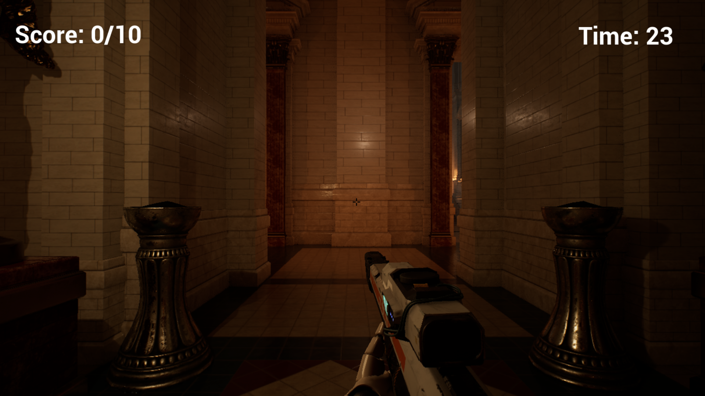
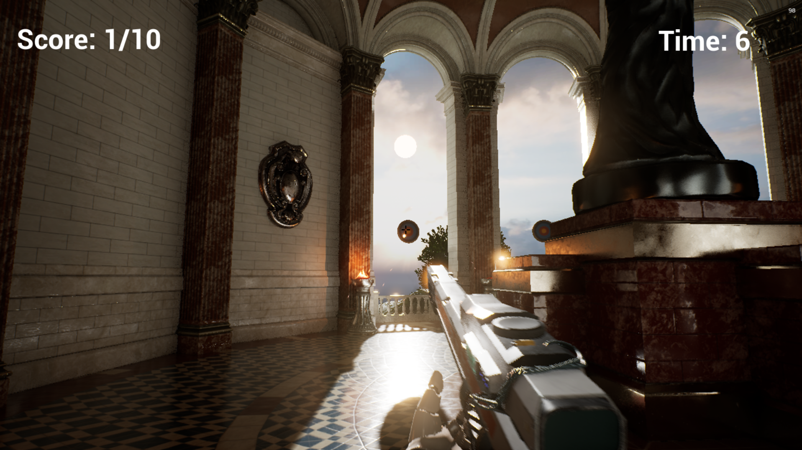
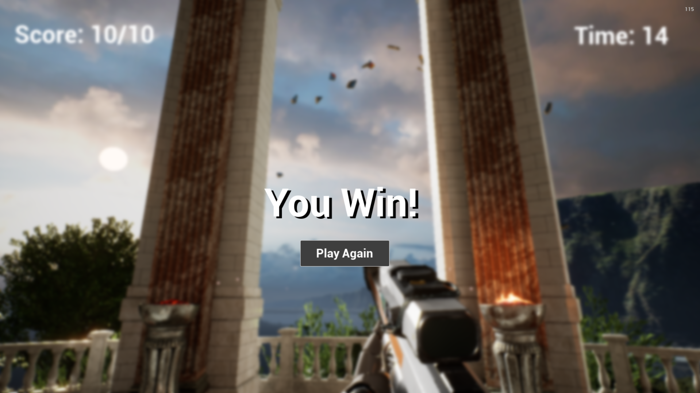
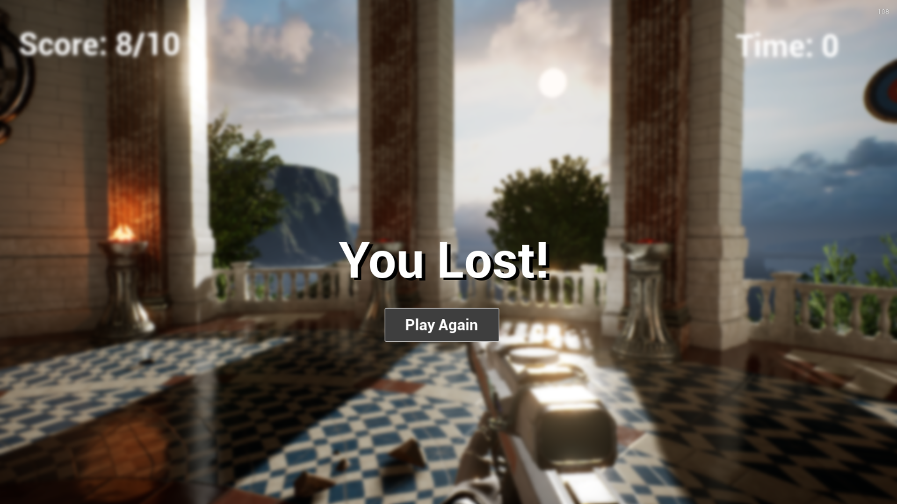

# 🎮 FirstGame

A game project developed using **Unreal Engine 5**.

This project was created to explore game development, level design, gameplay mechanics, and Unreal Engine's development workflow.

---

## 🎬 Gameplay

Watch the gameplay recording below:

[▶️ Open Gameplay Video](Demo/gameplay.mp4)

---

## 📸 Screenshots

### Gameplay


### Environment


### Game States




---

## ✨ Features

- Interactive gameplay
- 3D game environment
- Player movement and controls
- Gameplay mechanics
- Level design and environment setup
- Unreal Engine 5-based development

---

## 🛠️ Built With

- **Unreal Engine 5**
- **Blueprints**
- **3D Assets**
- **Unreal Engine Level Editor**

---

## 🧠 What I Learned

Through this project, I gained hands-on experience with:

- Unreal Engine 5's development workflow
- Creating and designing game levels
- Implementing gameplay mechanics using Blueprints
- Working with 3D assets and environments
- Packaging and testing an Unreal Engine game
- Debugging gameplay and project issues

---

## 🎮 Play the Game

A packaged Windows build is available in the **Releases** section.

> **Note:** The repository contains the project showcase, screenshots, and gameplay demonstration. The packaged game build is provided separately because of its large size.

---

## 📂 Repository Structure

```text
FirstGame/
│
├── README.md
│
├── Demo/
│   └── gameplay.mp4
│
├── Screenshots/
│   ├── gameplay-01.png
│   ├── gameplay-02.png
│   ├── gameplay-03.png
│   └── gameplay-04.png
│
└── LICENSE